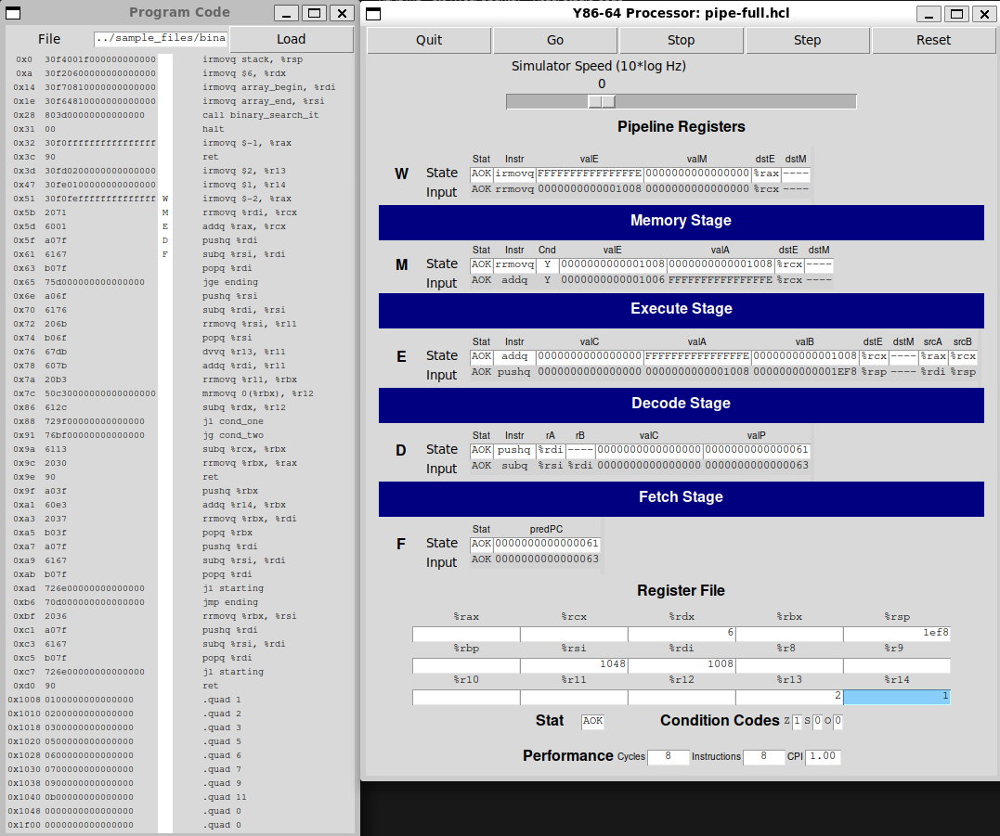

In this project, I worked on designing and implementing a pipelined Y86-64 processor, focusing on optimizing both the processor and a benchmark program to maximize performance. I applied several semantics-preserving transformations to the benchmark code and made enhancements to the pipelined processor to achieve these improvements. Through this process, I gained a deeper understanding of how code and hardware interact to affect program performance.

The project was divided into three parts. In Part A, I wrote simple Y86-64 programs and became familiar with the tools. In Part B, I extended the SEQ simulator by adding a new instruction, laying the groundwork for Part C. In the final part, I optimized both the Y86-64 benchmark program and the processor design, completing the core of the project.

The visualized simulation of a binary search algorithm on our optimized pipe processor.